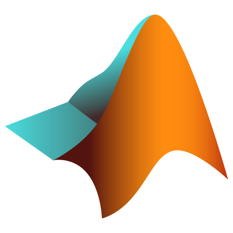

<h1 align="center">Hi there, I'm Koushik Kiran Kumar - <a href="https://scholars.iitm.ac.in:443/profile/CS19S014">K3</a> 👋</h2>

<h2 align="center">About Me :raising_hand_man:</h2>

- I'm a MS Research Scholar at Department of Computer Science and Engineering, Indian Institute of Technology, Madras, India.
- I'm currently working in the field of Algorithms, Complexity Theory, Knowledge Compilation and Boolean Circuit Theory. 
- My current interests are in the Design and Analysis of Algorithms, Networking, Fullstack Development, Machine Learning and Deep Learning.

<h2 align="center">Skills :man_technologist:</h2>

 &nbsp;
 &nbsp;
 &nbsp;
 &nbsp;
 &nbsp;
 &nbsp;
 &nbsp;
 &nbsp;
 &nbsp;
 &nbsp;
 &nbsp;
 &nbsp;
 &nbsp;
 &nbsp;
 &nbsp;
 &nbsp;
 &nbsp;
 &nbsp;

<h2 align="center">Github stats :bar_chart:</h2>

<h4 align="center">Visitor's count :eyes:</h4>

  
  
 

<h2 align="center">Connect With Me :incoming_envelope: :mailbox_with_mail:</h2>
 

  <a href="https://twitter.com/_imK3_"> &ensp;</a>
  <a href="https://www.linkedin.com/in/ornkkk/"> &ensp;</a>   
  <a href="https://github.com/ornkkk"> &ensp;</a>   
  <a href="mailto:ornkkk@gmail.com"> &ensp;</a>
 

              

[website]: https://scholars.iitm.ac.in:443/profile/CS19S014
[gmail]: mailto:ornk3.2104@gmail.com
[instagram]: https://instagram.com/_its_k3_
[linkedin]: https://linkedin.com/in/ornkkk
[codepen]: https://codepen.io/ornkkk
[Twitter]: https://www.twitter.com/_imK3_

