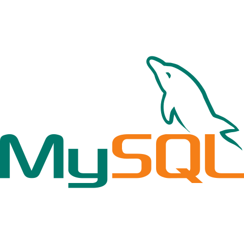

## Hi there, I'm Koushik Kiran Kumar - [K3][website] 👋

## About Me

- I'm a Research Scholar at Department of Computer Science and Engineering, Indian Institute of Technology, Madras, India.
- Im currently working in the field of Algorithms, Complexity Theory, Knowledge Compilation and Circuit Theory. 
- My current interests are in the Design and Analysis of Algorithms, Networking, Fullstack Development, Machine Learning and Deep Learning.

 

## Skills:

 

---

  <table>
    <tr>
        <td></td>
        <td></td>
    </tr>   
  </table>

  

---

 

## Connect with me:

[][gmail]
              

[website]: https://scholars.iitm.ac.in:443/profile/CS19S014
[gmail]: mailto:ornk3.2104@gmail.com
[instagram]: https://instagram.com/_its_k3_
[linkedin]: https://linkedin.com/in/ornkkk
[codepen]: https://codepen.io/ornkkk
[Twitter]: https://www.twitter.com/_imK3_

